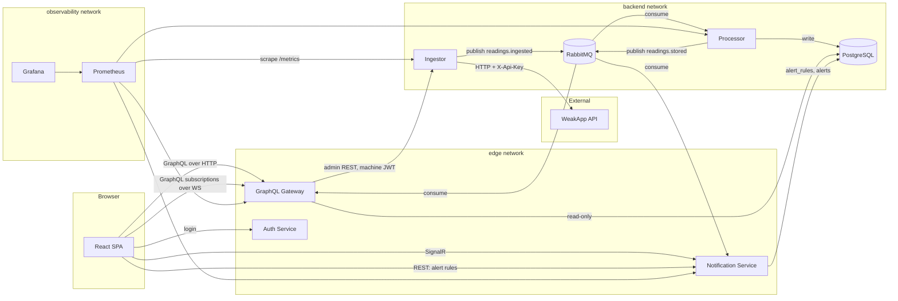

# WeakAppHandler — Product Requirements Document

**Status:** Draft for implementation
**Repository:** `Mmishaaa/WeakAppHandler`
**Document owner:** Mikhail Kochyn

---

## 1. Overview and Goals

### 1.1 Summary

WeakAppHandler is a microservice platform that turns an unreliable third-party sensor API into a dependable, queryable, real-time monitoring system. It continuously polls the external **WeakApp API** for readings from environmental meters distributed across rooms, absorbs that API's failures without losing or corrupting data, persists a complete time series, and presents it through a strongly-typed GraphQL API and a live web dashboard with threshold-based alerting.

The defining constraint of this product is that **the data source is hostile**. WeakApp randomly returns HTTP 502 and 504, occasionally responds with malformed JSON declared as `application/json`, injects arbitrary latency, enforces an undocumented per-IP rate limit that answers with HTTP 429, and serves cached data so that consecutive polls frequently return byte-identical results. Every architectural decision in this document is traceable to one of those behaviours.

### 1.2 Goals

| ID | Goal | Measure of success |
|----|------|--------------------|
| G1 | Ingest readings from WeakApp without data loss under failure | No reading that WeakApp successfully returned is missing from the database; every failed poll is recorded with its cause |
| G2 | Decouple ingestion from persistence | Ingestion continues while the database or processor is unavailable; queued messages drain on recovery |
| G3 | Provide correct, cheap aggregation | Time-window aggregates are mathematically sound; latest-value lookup is a single-row read |
| G4 | Deliver a strongly-typed, filterable GraphQL API | Schema covers filtering, pagination, aggregation and subscriptions with no untyped escape hatches |
| G5 | Notify users of threshold breaches in real time | Alert reaches a connected browser within two seconds of the breaching reading being persisted |
| G6 | Run the entire system with one command | `docker compose up` on a clean machine yields a working dashboard with live data and no manual steps |
| G7 | Make system behaviour observable | Traces span ingest → queue → persist → notify; failure rates and circuit-breaker state are visible on a dashboard |

### 1.3 Non-goals

- Controlling or actuating devices — the system is read-only with respect to the physical world.
- Replacing WeakApp with real hardware integrations (see §12).
- Multi-tenancy or organisation-level data isolation.
- Mobile native applications; the web UI is responsive and that is sufficient.

---

## 2. Target Audience

### 2.1 Primary users

**Facility Operator (role: `viewer`)** — monitors rooms during a shift. Needs to answer three questions quickly: what are the current values, is anything wrong right now, and how did a given metric behave over the last hours. Does not configure anything.

**System Administrator (role: `admin`)** — everything a viewer can do, plus defines the alert rules that determine what counts as "wrong", and supervises the ingestion pipeline itself: whether polling is healthy, what the external API is currently doing, and how often it is failing.

### 2.2 Secondary audience

**Technical reviewer** — inspects the repository and observes a live walkthrough, asking questions about architectural choices. This audience does not change *what* is built, but it does mean the system must be self-explanatory: the failure handling has to be visible and demonstrable rather than merely present in the code. §11 defines the walkthrough scenarios this requirement produces.

---

## 3. External Dependency: WeakApp API

> **Verification status — read before implementing against this section.**
> The upstream repository ships only a compiled `publish/` folder and a four-line README. Everything below was **derived by static inspection of `WeakAppApi.dll`** — string literals and type metadata — and has **not been confirmed against a running instance**. Each claim is tagged accordingly:
>
> - **[confirmed]** — read directly from the assembly; cannot reasonably mean anything else.
> - **[inferred]** — follows from framework defaults or naming conventions, but not directly observed.
> - **[assumed]** — not present in the assembly at all; supplied by this document as a reasonable default.
>
> Before `F1` is implemented, the upstream service must be run once and a real response captured (see §3.5). Any discrepancy invalidates this section, not the implementation built from it.

### 3.1 Interface

| Property | Value |
|----------|-------|
| Data endpoint | `GET /meters` |
| Health endpoints | `GET /health`, `GET /healthz`, `GET /.well-known/health` |
| Authentication | Header `X-Api-Key: supersecret` |
| Container port | `8080` |
| Runtime | .NET 9 (ASP.NET) |
| Licence | MIT |

An unused `GET /weatherforecast` endpoint remains from the project template and must be ignored.

### 3.2 Response shape

`GET /meters` returns a JSON array **[inferred]** — the assembly exposes a `MeterData` type with `Name`, `Type` and `Payload` properties, but whether the array is returned bare or inside an envelope was not observed.

| Field | Type | Domain | Status |
|-------|------|--------|--------|
| `name` | string | `Kitchen`, `Living Room`, `Bedroom`, `Garage`, `Office`, `Corridor` | Domain **[confirmed]**; JSON casing **[inferred]** |
| `type` | string | `energy`, `air_quality`, `motion` | Domain **[confirmed]**; JSON casing **[inferred]** |
| `payload` | object | Variant determined by `type` | **[confirmed]** |

The CLR properties are declared `Name`, `Type` and `Payload`, but ASP.NET Core serialises with a camelCase naming policy by default, so the wire format is expected to be lower-cased. **Client models must not be written against the PascalCase form until a real response confirms which is correct.**

Payload variants **[confirmed]** — these are the literal `ToString()` format templates of the anonymous payload types found in the assembly (`{{ energy = {0} }}`, `{{ co2 = {0}, pm25 = {1}, humidity = {2} }}`, `{{ motionDetected = {0} }}`):

| `type` | Payload fields |
|--------|----------------|
| `energy` | `energy` (number) |
| `air_quality` | `co2` (number), `pm25` (number), `humidity` (number) |
| `motion` | `motionDetected` (boolean) |

**Unknowns that affect design decisions:**

- **Units and value ranges [assumed].** The assembly contains no unit information. §7.1 assigns conventional units, which are placeholders until verified.
- **Semantics of `energy` [assumed].** Whether it reports instantaneous power or cumulative consumption is unknown, and the two demand different aggregation — average versus difference-over-window. §7 currently assumes an instantaneous reading aggregated by average and sum.
- **Meter cardinality [assumed].** This document assumes six locations × three types = eighteen meters. The assembly generates data randomly and may not emit every combination in every response.
- **Instability parameters [not extracted].** Error probability, cache duration, rate-limit threshold and delay range are IL constants that were not decompiled. Ingestor configuration defaults must therefore be derived empirically.

**Critical gap [confirmed]:** responses contain **no timestamp and no identifier**. Observation time must be assigned by our system at fetch time, and message identity must be synthesised. F1 and F3 address the consequences.

### 3.5 Required verification step

Before implementing `F1`, run the upstream service once and capture a real response:

```
git clone https://github.com/nantonov/WeakApp.git
cd WeakApp
docker build -t weakapp .
docker run -d -p 8080:8080 --name weakapp weakapp
curl -H "X-Api-Key: supersecret" http://localhost:8080/meters
```

Repeat the request roughly ten times in succession and record: the exact JSON casing and envelope shape, the number of meters returned, observed value ranges per metric, how frequently 502/504/corrupted responses occur, and after how many rapid requests HTTP 429 appears together with its `Retry-After` value.

The captured output should be committed to `docs/weakapp-observed-response.json` so that contract tests can assert against a real sample rather than an assumed one, and this section updated to replace **[inferred]** and **[assumed]** tags with observed facts.

### 3.3 Failure modes

| Mode | Manifestation | Required handling |
|------|---------------|-------------------|
| Upstream error | HTTP 502 / 504 with a JSON error body | Retry with exponential backoff and jitter; open circuit breaker after repeated failures |
| Corrupted payload | HTTP 200 with body `{"error": "data corrupted"}` under `Content-Type: application/json` | Detect during deserialisation; discard the batch, record outcome `corrupted`, do not retry immediately |
| Rate limiting | HTTP 429 with a `Retry-After` header, applied per client IP | Honour `Retry-After` exactly; never retry sooner |
| Random latency | Arbitrary delay before responding | Per-request timeout shorter than the polling interval; a timed-out poll is recorded and skipped, never queued |
| Server-side caching | Consecutive polls return identical data | Do not treat repetition as new information; see the change-detection rule in §6.3 |
| Missing API key | HTTP 401 with `Invalid or missing API key` | Treat as fatal configuration error: log at error level, surface in ingestion status, do not retry in a tight loop |

### 3.4 Packaging

WeakApp is **vendored** into `third_party/weak-app/` (its `Dockerfile` and `publish/` directory), accompanied by `THIRD_PARTY.md` recording the upstream repository, the exact source commit and the MIT licence text.

*Technical considerations.* A git submodule would express provenance more cleanly, but it makes the build depend on a third-party repository remaining available and on every clone using `--recurse-submodules`. Since a reviewer's first action is `git clone && docker compose up`, hermetic reproducibility outweighs elegance. Publishing a pre-built image to GHCR is a valid later optimisation and is listed in §12.

---

## 4. Architecture

### 4.1 Service topology



### 4.2 Services

| Service | Responsibility | Style |
|---------|----------------|-------|
| **Ingestor** | Polls WeakApp on a schedule, applies resilience policies, publishes raw batches to the queue, exposes admin REST | Thin worker; no domain layer |
| **Processor** | Consumes batches, deduplicates, normalises, persists readings and current state, publishes stored-reading events | Clean Architecture + CQRS |
| **GraphQL Gateway** | Serves the typed read API and subscriptions to the frontend; proxies admin operations to Ingestor | Clean Architecture + CQRS (queries only) |
| **Notification Service** | Owns alert rules, evaluates thresholds, pushes alerts over SignalR, exposes rules REST | Layered; rule engine isolated as a pure component |
| **Auth Service** | Issues user JWTs and machine JWTs; publishes JWKS | Minimal; single bounded responsibility |
| **Frontend** | React SPA — dashboards, history, alert feed, administration | Feature-sliced structure |

### 4.3 Communication rules

Services do not call each other synchronously except for one deliberate path (Gateway → Ingestor admin API). All other inter-service communication flows through RabbitMQ. This is a design commitment, not an accident: it means a failure in any consumer cannot propagate back into ingestion.

**Threshold evaluation lives in the Notification Service**, not the Processor. The rules are that service's data, so co-locating evaluation with them avoids a synchronous dependency. The Processor supplies the previous value inside every `readings.stored` event — it already computes that value for change detection — which lets the Notification Service detect threshold transitions without holding state of its own.

**GraphQL subscriptions are fed from RabbitMQ**, not from PostgreSQL `LISTEN/NOTIFY` and not by a push from the Processor. This keeps the Gateway stateless and horizontally scalable.

---

## 5. Technical Stack

| Layer | Choice | Alternatives considered | Rationale |
|-------|--------|------------------------|-----------|
| Backend runtime | .NET 10 (LTS) | .NET 9; polyglot services | Latest stable release; single stack keeps CI, shared contracts and tooling uniform |
| GraphQL server | HotChocolate | GraphQL.NET | Richer schema-first tooling, native filtering/sorting/projection middleware, built-in subscription transports |
| Messaging | RabbitMQ + MassTransit | Kafka; raw `RabbitMQ.Client` | Queue semantics fit command-style batches better than a log; MassTransit supplies retry, dead-lettering and outbox patterns without hand-rolling |
| Database | PostgreSQL 17 + EF Core | MongoDB; TimescaleDB | Relational aggregation is the dominant query pattern; TimescaleDB's advantages appear at a data volume this system will not reach |
| Real-time | SignalR (alerts) + `graphql-ws` (reading stream) | SignalR only | Two channels with distinct semantics; see §6.7 |
| Frontend | React 19 + TypeScript + Vite | Angular | Faster iteration and a lighter toolchain for a dashboard of this size |
| GraphQL client | Apollo Client | urql, Relay | Normalised cache and first-class subscription support with minimal configuration |
| Charts | Recharts | Chart.js, visx | Declarative React composition; sufficient for line, area and bar charts |
| Resilience | Polly (via `Microsoft.Extensions.Http.Resilience`) | Hand-written retry | Standard pipelines for retry, timeout, circuit breaker and rate-limit awareness |
| Validation | FluentValidation | DataAnnotations | Expressive rules; integrates with MediatR pipeline behaviours |
| Mediation | MediatR | Direct service calls | Enables CQRS separation and cross-cutting pipeline behaviours (validation, logging, metrics) |
| Logging | Serilog | Built-in `ILogger` only | Structured logging with correlation enrichment and consistent sinks |
| Telemetry | OpenTelemetry → Prometheus → Grafana | Application Insights | Vendor-neutral; runs entirely inside compose |
| Static analysis | StyleCop.Analyzers, .NET analyzers, `TreatWarningsAsErrors` | — | Enforces the "no warnings, no code smells" requirement in the build itself |
| Testing | xUnit, FluentAssertions, Testcontainers, Playwright | NUnit; in-memory database fakes | Testcontainers gives integration tests a real PostgreSQL and RabbitMQ rather than a fake |

---

## 6. Features

Feature identifiers (`F1`…`F12`) are used throughout the document and should be referenced in branch names, pull request titles and commit scopes.

### F1 — Resilient Ingestion

The Ingestor polls `GET /meters` on a configurable interval and converts each response into a queue message.

**Behaviour**

- Default polling interval: **10 seconds**, configurable through `Ingestion:PollingIntervalSeconds` and changeable at runtime via the admin API.
- Each attempt is wrapped in a resilience pipeline: total request timeout, retry with exponential backoff and jitter, circuit breaker, and explicit `Retry-After` handling for HTTP 429.
- When the circuit breaker is open, polling is suspended until the break duration elapses; the state is exposed through the admin API and as a metric.
- Every attempt — successful or not — produces an `IngestBatch` record describing what happened.
- Only successful, well-formed responses are published to the queue.

**Acceptance criteria**

- Given WeakApp returns HTTP 502, the poll is retried according to policy and, if all attempts fail, an `IngestBatch` with outcome `http_error` is recorded and nothing is published.
- Given WeakApp returns HTTP 429 with `Retry-After: 30`, no request is issued for at least 30 seconds and the batch outcome is `rate_limited`.
- Given the response body is `{"error": "data corrupted"}`, deserialisation fails, the batch outcome is `corrupted`, and the payload is logged at warning level with its raw content truncated to a bounded length.
- Given repeated failures exceed the breaker threshold, the circuit opens, polling pauses, and `GET /api/v1/ingestion/status` reports `circuitState: "Open"`.
- Given the API key is missing or wrong, the batch outcome is `unauthorized` and the error is logged once per state change rather than once per attempt.
- The service starts successfully even when WeakApp is unavailable, and recovers automatically when it returns.

*Technical considerations.* The polling loop is a `BackgroundService`. Retries must never exceed the polling interval in aggregate, otherwise polls overlap; use a timeout budget shorter than the interval and skip a cycle rather than queueing overlapping work. Reference: [Polly resilience strategies](https://www.pollydocs.org/strategies/index.html), [`Microsoft.Extensions.Http.Resilience`](https://learn.microsoft.com/dotnet/core/resilience/http-resilience).

---

### F2 — Message Transport Contract

**Behaviour**

- Exchange `readings.exchange`, routing key `readings.ingested`, message type `ReadingsIngested`.
- Message envelope fields: `messageId` (UUID, generated per batch), `fetchedAt` (UTC instant the response was received), `sourceLatencyMs`, and `readings[]` where each entry carries `location`, `meterType`, `payload` and `payloadHash`.
- Messages are persistent; the queue is durable.
- Failed consumption is retried by MassTransit; messages exhausting retries land in a dead-letter queue.

**Acceptance criteria**

- Restarting RabbitMQ does not lose messages already acknowledged as persistent.
- A message that repeatedly fails processing appears in the dead-letter queue and is visible in the RabbitMQ management UI.
- Message contracts live in a shared project referenced by both producer and consumer, so a contract change breaks the build rather than production.

---

### F3 — Processing and Persistence

The Processor consumes `ReadingsIngested`, normalises payloads into a flat metric fact table, and maintains current state.

**Behaviour**

- **Message idempotency.** Before processing, `messageId` is checked against the `processed_messages` table. A duplicate is acknowledged and discarded. This is mandatory: RabbitMQ delivers at least once.
- **Meter registry.** `(location, meterType)` identifies a meter. Unknown combinations create a `meters` row automatically, so new rooms or sensor types require no migration.
- **Normalisation.** Each payload is flattened into one `readings` row per metric. An `air_quality` payload therefore yields three rows: `co2`, `pm25`, `humidity`.
- **Change detection.** Each metric value is compared with the corresponding `meter_current_state` row. `is_changed` records whether the value differs from the previous one. Every reading is stored regardless.
- **Current state.** `meter_current_state` is upserted with the new value, the observation time, and — when the value changed — the change time and the previous value.
- **Event emission.** A `readings.stored` event is published containing the new value, the previous value and `isChanged`.

**Acceptance criteria**

- Delivering the same `messageId` twice results in exactly one set of `readings` rows.
- An `air_quality` reading produces three `readings` rows sharing one `observed_at`.
- The second consecutive identical poll produces rows with `is_changed = false` while `meter_current_state.observed_at` still advances.
- `meter_current_state` always reflects the most recent reading for every `(meter, metric)` pair.
- Processing a batch of eighteen metrics completes well within the polling interval.

*Technical considerations — why every reading is stored.* Three strategies were evaluated. Storing only changes yields a compact table but breaks time-window aggregation: a value that held for fifty minutes and one that held for ten seconds are not equally weighted, so a plain `AVG()` returns a wrong answer and correctness requires duration-weighted interpolation. Storing everything without change metadata keeps aggregation trivial but loses the notion of "last changed" and makes the alert feed noisy. The hybrid adopted here — store everything, flag changes, maintain a separate current-state table — keeps aggregates mathematically simple, makes latest-value lookup a single indexed row read, and gives alerting a clean transition signal. At roughly 155,000 rows per day the storage cost is immaterial for PostgreSQL.

---

### F4 — GraphQL API

The Gateway exposes the read model. The schema is strongly typed throughout; no `JSON` or `Any` scalars are used for domain data.

**Queries**

| Query | Purpose |
|-------|---------|
| `meters` | List meters with their current values, filterable by location and meter type |
| `readings` | Paginated historical readings with filtering by meter, metric, location, type and time range |
| `aggregations` | Bucketed aggregates over a time range: `avg`, `min`, `max`, `sum`, `count`, grouped by location, meter type or metric |
| `alerts` | Paginated alert history, filterable by status, severity, location and time range |
| `alertRules` | Current rule set |
| `ingestionStatus` | Proxied Ingestor health (admin only) |

**Subscription**

- `onReadingStored(location, meterType)` — streams newly persisted readings matching the filter.

**Behaviour**

- Cursor-based (Relay-style) pagination with a maximum page size of 100.
- Aggregation buckets: `minute`, `hour`, `day`, chosen explicitly by the caller.
- Query depth and complexity limits are enforced; introspection is disabled outside Development.
- All resolvers use projection so that GraphQL field selection translates into narrow SQL.

**Acceptance criteria**

- Requesting readings for one location over one hour returns only matching rows, correctly paginated, with a stable cursor.
- An aggregation query grouped by location over 24 hourly buckets returns 24 buckets per location, including buckets with zero readings represented explicitly.
- Requesting a page size above the maximum returns a validation error rather than a large result.
- A deliberately deep nested query is rejected with a complexity error.
- A subscribed client receives an event within two seconds of a reading being persisted.
- The schema snapshot is committed to the repository and verified in CI, so schema drift becomes a failing build.

*Technical considerations.* Reference: [HotChocolate filtering](https://chillicream.com/docs/hotchocolate/v15/fetching-data/filtering), [pagination](https://chillicream.com/docs/hotchocolate/v15/fetching-data/pagination), [subscriptions](https://chillicream.com/docs/hotchocolate/v15/defining-a-schema/subscriptions). Aggregation queries must be expressed as SQL `GROUP BY` with `date_trunc` or `time_bucket`-style bucketing rather than materialised in memory — a naive `.ToList()` before grouping is the single most likely performance defect in this feature.

---

### F5 — REST APIs

REST is used where it is objectively the better fit, not as a parallel copy of the GraphQL read model.

| Service | Endpoint | Purpose | Access |
|---------|----------|---------|--------|
| Notification | `GET/POST/PUT/DELETE /api/v1/alert-rules` | Alert rule CRUD | `admin` |
| Ingestor | `GET /api/v1/ingestion/status` | Last poll, failure counters by cause, circuit state, active interval | machine JWT |
| Ingestor | `POST /api/v1/ingestion/trigger` | Force an immediate poll | machine JWT |
| Ingestor | `PUT /api/v1/ingestion/config` | Change polling interval at runtime | machine JWT |
| Processor | `GET /api/v1/processing/stats` | Processed, deduplicated and dead-lettered counts | machine JWT |
| Gateway | `GET /api/v1/readings/export` | CSV export of a filtered range | `viewer` |
| All | `GET /health/live`, `GET /health/ready`, `GET /metrics` | Health and metrics | internal networks only |

**Acceptance criteria**

- Every REST surface is documented through OpenAPI and browsable via a UI in Development.
- Creating an alert rule with an invalid operator or a negative cooldown returns HTTP 400 with a field-level validation message.
- `POST /api/v1/ingestion/trigger` causes a poll within one second and returns the resulting batch outcome.
- CSV export streams rather than buffering the whole result set in memory.
- Health endpoints report `ready` as unhealthy while a required dependency is unreachable.

---

### F6 — Alerting Engine

**Rule model**

A rule is: *location* (or any) + *meter type* + *metric* + *operator* + *threshold* + *severity*, plus hysteresis and cooldown parameters.

**Evaluation semantics**

1. **Transition-triggered.** An alert is raised when a metric *crosses* a threshold, not on every reading beyond it. At a ten-second polling interval, level-triggered alerting would generate hundreds of duplicate notifications for a single open window.
2. **Hysteresis.** A breach clears only once the value retreats past the threshold by a configurable margin (default 5%). Without this, a value oscillating around the threshold produces an endless trigger/resolve cycle.
3. **Cooldown.** A minimum interval between successive alerts from the same rule (default 300 seconds), as a second-line guard.
4. **Explicit resolution.** When a value returns to normal, the active alert transitions to `resolved` with a resolution time and value, and a resolution event is pushed to clients. This makes "how many problems are active right now" a real, answerable question.

```
on ReadingStored(meter, metric, value, previousValue):
    for each enabled rule matching (meter.location, meter.type, metric):
        breaching        = compare(value, rule.operator, rule.threshold)
        wasBreaching     = compare(previousValue, rule.operator, rule.threshold)
        activeAlert      = findActiveAlert(rule, meter)

        if breaching and not wasBreaching and activeAlert is null:
            if now - rule.lastTriggeredAt >= rule.cooldown:
                createAlert(rule, meter, value, status = active)
                publishAlertRaised()

        else if activeAlert is not null and not breaching:
            if hasClearedHysteresisBand(value, rule):
                resolveAlert(activeAlert, value)
                publishAlertResolved()
```

**Seed rules**

The system ships with an enabled default rule set so the alert feed is populated shortly after first start rather than appearing to be an unfinished feature:

| Metric | Condition | Severity |
|--------|-----------|----------|
| `co2` | `> 1000` | `warning` |
| `co2` | `> 1400` | `critical` |
| `pm25` | `> 35` | `warning` |
| `humidity` | `> 70` | `info` |
| `motionDetected` | `= true` in `Garage` | `warning` |

**Acceptance criteria**

- A metric rising past a threshold produces exactly one alert, regardless of how many subsequent readings remain above it.
- A metric oscillating within the hysteresis band produces no additional alerts.
- A metric returning below the threshold minus the hysteresis margin resolves the active alert and emits a resolution event.
- Alerts persist across restarts; the feed is rebuilt from the database on page load.
- Seed rules are applied idempotently — restarting the stack does not duplicate them.
- Rule evaluation logic is covered by unit tests with no infrastructure dependencies, including boundary cases at exactly the threshold and exactly the hysteresis edge.

---

### F7 — Real-Time Delivery

Two channels with deliberately distinct roles.

| Channel | Transport | Carries | Rationale |
|---------|-----------|---------|-----------|
| `AlertsHub` | SignalR | Alert raised, alert resolved | Rare, important events; explicitly required |
| `onReadingStored` | GraphQL subscription over `graphql-ws` | Continuous reading stream | Same schema and generated types as queries |

**Acceptance criteria**

- A browser receives an alert within two seconds of the breaching reading being persisted.
- Reconnection after a dropped connection is automatic, with backoff, and the UI reflects connection state.
- On reconnect the client reconciles missed alerts by refetching, so no alert is silently lost.
- The same logical event is never delivered to a single UI component through both channels.
- SignalR connections require a valid JWT; anonymous connections are rejected.

*Technical considerations.* With more than one Notification Service replica, SignalR requires a backplane. Reference: [SignalR scale-out](https://learn.microsoft.com/aspnet/core/signalr/scale). Single-replica operation is acceptable here, but the constraint must be documented rather than discovered later.

---

### F8 — Frontend

Four screens. Depth is preferred over breadth: a fifth section would dilute the three that matter.

**Overview** — the default screen.
- Tiles for every meter grouped by location, showing the latest value, unit, and time since last update.
- Colour state derived from active alerts: normal, warning, critical.
- Header summary: meters reporting, time of last successful poll, count of currently active alerts.

**History**
- Metric or location selector, period selector (hour, day, week).
- Line or area chart of the selected metric; bar chart for motion event counts.
- Aggregation appropriate to the metric: sum and average for energy; average with min/max band for CO₂, PM2.5 and humidity; occurrence count for motion.

**Alerts**
- Reverse-chronological feed with severity, location, metric, triggering value, and duration for resolved entries.
- New alerts arrive over SignalR and are visually highlighted on arrival.
- Filters by status and severity.

**Administration** (`admin` only)
- Alert rule CRUD with inline validation.
- Ingestion panel: last poll outcome, error counters by cause, circuit-breaker state, polling interval control, and a manual trigger button.

**Cross-cutting requirements**

- Every asynchronous view implements four distinct states: loading (skeleton, not a spinner overlay), empty, error with a retry affordance, and loaded.
- A failed GraphQL request never blanks the screen; the last good data remains visible with a staleness indicator.
- Responsive from 360 px upward; tiles reflow, charts resize, tables scroll horizontally within their own container.
- Colour is never the sole carrier of meaning — severity is also conveyed by icon and text.
- Types for all GraphQL operations are generated from the schema; hand-written response types are not permitted.

**Acceptance criteria**

- With the backend stopped, the application renders an error state with a working retry rather than a blank page or an unhandled exception.
- Charts remain legible at 360 px width.
- Keyboard navigation reaches every interactive control, and focus states are visible.
- A `viewer` cannot see or reach the Administration screen, and the API rejects the request even if the route is entered manually.

---

### F9 — Authentication and Authorisation

**Behaviour**

- Auth Service issues RS256-signed JWTs and publishes a JWKS endpoint; every other service validates signatures against it.
- Two grant types: user login (email and password) and client credentials for service-to-service access.
- Roles: `viewer` (read dashboards) and `admin` (adds rule management and ingestion control).
- Access tokens are short-lived and held in memory by the SPA; the refresh token is stored in an `httpOnly` cookie.
- The single machine-to-machine path (Gateway → Ingestor) uses a client-credentials token scoped `ingestion:admin`.

**Acceptance criteria**

- Requests without a valid token are rejected with HTTP 401; valid tokens lacking the required role are rejected with HTTP 403.
- An expired access token is refreshed transparently without user-visible interruption.
- Tokens signed by an unknown key are rejected.
- Seeded credentials for both roles exist and are documented in the README so the system is usable immediately after first start.

---

### F10 — Observability

**Behaviour**

- OpenTelemetry traces span the full path: HTTP call to WeakApp → publish → consume → persist → notify, correlated by trace ID propagated through message headers.
- Metrics exported in Prometheus format: poll outcomes by cause, poll latency histogram, circuit-breaker state, queue consumption rate, processing latency, deduplicated message count, dead-letter depth, alerts raised and resolved, GraphQL request duration.
- A provisioned Grafana dashboard ships with the repository and loads automatically — no manual dashboard creation.
- Serilog writes structured JSON with correlation identifiers on every log entry.

**Acceptance criteria**

- A single reading can be followed end to end through one trace.
- The Grafana dashboard shows WeakApp failure rate and circuit-breaker state without any manual configuration after `docker compose up`.
- Log entries carry a correlation identifier that ties them to the originating poll.

---

### F11 — Deployment

**Behaviour**

- A single `docker-compose.yml` brings up: WeakApp, RabbitMQ (with management UI), PostgreSQL, Auth, Ingestor, Processor, Gateway, Notification, Frontend, Prometheus, Grafana.
- Service start order is governed by health checks, not by `sleep`.
- Database schema is applied automatically at startup through EF Core migrations.
- Three networks: `edge`, `backend`, `observability`. The frontend container has no route to RabbitMQ or PostgreSQL.
- Configuration comes from environment variables; `.env.example` is committed and `.env` is ignored.
- Containers run as non-root users.

**Acceptance criteria**

- On a machine with only Docker installed, `git clone` followed by `docker compose up` produces a working dashboard with live data and requires no further steps.
- Restarting the stack preserves data through named volumes.
- No credential appears in any committed file other than `.env.example`.
- `docker compose down -v` followed by `docker compose up` reproduces a clean working system, seed rules included.

---

### F12 — CI/CD

**Behaviour**

- One GitHub Actions workflow per service and one for the frontend, each triggered only by changes under its own path.
- Every workflow: restore, build with warnings as errors, run unit tests, run integration tests via Testcontainers, run linting and static analysis, build the Docker image.
- Frontend workflow additionally runs ESLint, TypeScript type checking, and Playwright end-to-end tests against a compose-launched stack.
- A pull-request title check enforces Conventional Commits.
- `main` is protected: direct pushes are refused, a passing pipeline is required.

**Acceptance criteria**

- Modifying only the frontend does not trigger backend workflows.
- A compilation warning fails the build.
- A pull request cannot be merged while any required check is failing.
- Docker image build is validated in CI even when the image is not published.

---

## 7. Conceptual Data Model

Names below are the canonical terminology for this project and should map directly to code identifiers.

### 7.1 Entities

**`meters`** — a physical sensor, identified by the room it sits in and what it measures.

| Field | Type | Notes |
|-------|------|-------|
| `id` | uuid | Primary key |
| `location` | varchar(64) | e.g. `Kitchen` |
| `meter_type` | varchar(32) | `energy` \| `air_quality` \| `motion` |
| `first_seen_at` | timestamptz | |
| `last_seen_at` | timestamptz | Updated on every successful poll containing this meter |

Unique constraint on `(location, meter_type)`.

**`metrics`** — reference table describing each measurable quantity.

| Field | Type | Notes |
|-------|------|-------|
| `code` | varchar(32) | Primary key: `energy`, `co2`, `pm25`, `humidity`, `motion_detected` |
| `meter_type` | varchar(32) | Owning meter type |
| `unit` | varchar(16) | `kWh`, `ppm`, `µg/m³`, `%`, `—` — **assumed**, not supplied by the source API; see §3.2 |
| `value_kind` | varchar(16) | `numeric` \| `boolean` |
| `display_name` | varchar(64) | UI label |

**`readings`** — the fact table; one row per metric per poll.

| Field | Type | Notes |
|-------|------|-------|
| `id` | bigserial | Primary key |
| `meter_id` | uuid | → `meters.id` |
| `metric_code` | varchar(32) | → `metrics.code` |
| `observed_at` | timestamptz | Assigned by Ingestor at fetch time |
| `value_numeric` | numeric(12,4) | Null for boolean metrics |
| `value_bool` | boolean | Null for numeric metrics |
| `is_changed` | boolean | False when identical to the previous value |
| `batch_id` | uuid | → `ingest_batches.id` |

Indexes: `(meter_id, metric_code, observed_at DESC)`; BRIN on `observed_at`.

**`meter_current_state`** — latest value per meter and metric.

| Field | Type | Notes |
|-------|------|-------|
| `meter_id` | uuid | Composite primary key |
| `metric_code` | varchar(32) | Composite primary key |
| `value_numeric` | numeric(12,4) | |
| `value_bool` | boolean | |
| `previous_value_numeric` | numeric(12,4) | Supplied to the alert engine |
| `previous_value_bool` | boolean | |
| `observed_at` | timestamptz | Time of the latest reading |
| `changed_at` | timestamptz | Time the value last actually changed |

**`ingest_batches`** — the record of every poll attempt, successful or not.

| Field | Type | Notes |
|-------|------|-------|
| `id` | uuid | Primary key |
| `fetched_at` | timestamptz | |
| `outcome` | varchar(24) | `success` \| `http_error` \| `timeout` \| `corrupted` \| `rate_limited` \| `unauthorized` |
| `http_status` | int | Nullable |
| `duration_ms` | int | |
| `reading_count` | int | Zero for failures |
| `error_message` | text | Truncated, nullable |

**`processed_messages`** — idempotency ledger.

| Field | Type | Notes |
|-------|------|-------|
| `message_id` | uuid | Primary key |
| `processed_at` | timestamptz | |

**`alert_rules`**

| Field | Type | Notes |
|-------|------|-------|
| `id` | uuid | Primary key |
| `name` | varchar(128) | |
| `location` | varchar(64) | Null means any location |
| `metric_code` | varchar(32) | → `metrics.code` |
| `operator` | varchar(8) | `gt` \| `gte` \| `lt` \| `lte` \| `eq` |
| `threshold_numeric` | numeric(12,4) | |
| `threshold_bool` | boolean | |
| `severity` | varchar(16) | `info` \| `warning` \| `critical` |
| `hysteresis_percent` | numeric(5,2) | Default 5.00 |
| `cooldown_seconds` | int | Default 300 |
| `is_enabled` | boolean | Default true |
| `last_triggered_at` | timestamptz | Nullable |
| `created_at`, `updated_at` | timestamptz | |

**`alerts`**

| Field | Type | Notes |
|-------|------|-------|
| `id` | uuid | Primary key |
| `rule_id` | uuid | → `alert_rules.id` |
| `meter_id` | uuid | → `meters.id` |
| `metric_code` | varchar(32) | |
| `status` | varchar(16) | `active` \| `resolved` |
| `severity` | varchar(16) | Copied from the rule at trigger time |
| `triggered_at` | timestamptz | |
| `triggered_value` | numeric(12,4) | |
| `resolved_at` | timestamptz | Nullable |
| `resolved_value` | numeric(12,4) | Nullable |

Partial index on `status = 'active'`.

**`users`**

| Field | Type | Notes |
|-------|------|-------|
| `id` | uuid | Primary key |
| `email` | varchar(256) | Unique |
| `display_name` | varchar(128) | |
| `password_hash` | text | Argon2id or PBKDF2 |
| `role` | varchar(16) | `viewer` \| `admin` |
| `created_at` | timestamptz | |

**`service_clients`** — machine-to-machine credentials.

| Field | Type | Notes |
|-------|------|-------|
| `client_id` | varchar(64) | Primary key |
| `client_secret_hash` | text | |
| `scopes` | text[] | e.g. `{ingestion:admin}` |

### 7.2 Relationships

```
meters 1 ──── ∞ readings ∞ ──── 1 metrics
meters 1 ──── ∞ meter_current_state
meters 1 ──── ∞ alerts ∞ ──── 1 alert_rules
ingest_batches 1 ──── ∞ readings
```

### 7.3 Retention

`readings` older than 30 days are rolled up into hourly aggregates and the raw rows are deleted by a scheduled job. The retention window is configurable. This is not required for correctness but bounds unbounded growth and is a predictable question during review.

---

## 8. UI Design Principles

- **Information density over decoration.** The Overview screen answers "is anything wrong" before the reader scrolls.
- **State always visible.** Connection status, last successful poll and data staleness are permanently on screen, never hidden behind a menu.
- **Degrade, never blank.** Loss of a data source dims and annotates existing data rather than clearing it.
- **One accent colour plus a semantic severity scale.** Severity colours are reserved exclusively for severity.
- **Consistent time handling.** All timestamps are stored and transported in UTC and rendered in the browser's local timezone with an explicit relative indicator ("2 min ago").
- **Accessible by construction.** WCAG AA contrast, visible focus, semantic landmarks, ARIA live region for incoming alerts.
- **Responsive down to 360 px.** Tiles reflow to a single column, charts shrink rather than scroll, tables scroll inside their own container so the page never scrolls horizontally.

---

## 9. Security Considerations

**Perimeter.** The browser is the only untrusted client. It authenticates against the Auth Service and presents a JWT to the Gateway and Notification Service. CORS is restricted to the frontend origin.

**GraphQL hardening.** Query depth and complexity limits, maximum page size, disabled introspection outside Development, and persisted queries. Without these, a single deeply nested query can exhaust the server — the most commonly overlooked GraphQL risk.

**Message broker.** A dedicated vhost with one user per service, each granted the minimum permissions: Ingestor may only publish to `readings.exchange`; Processor may only consume its own queue and publish to `alerts.exchange`; Gateway may only consume. Default `guest` credentials are removed.

**Database.** One role per service. `gateway_ro` holds `SELECT` only and is therefore structurally incapable of corrupting data. `notification_rw` owns only the alerting tables.

**Network segmentation.** Three compose networks. The frontend container has no route to RabbitMQ or PostgreSQL; metrics endpoints are reachable only from the observability network.

**Secrets.** Supplied via environment variables and Docker secrets. Only `.env.example` is committed. No credential appears in `appsettings.json`.

**Containers.** Non-root users, read-only root filesystem where feasible, `no-new-privileges`.

**Machine-to-machine.** Client-credentials JWT with scope checking on the one synchronous inter-service path.

Mutual TLS between services and TLS for AMQP and PostgreSQL connections are deliberately out of scope and recorded in §12; the reasoning is that JWT plus least-privilege credentials plus network segmentation already prevents the realistic attack paths inside a single compose network.

---

## 10. Milestones

Each milestone ends in a state that can be demonstrated. Milestones map to feature identifiers and to branches; every milestone is delivered through one or more pull requests.

**M1 — Foundation.** Solution structure, shared kernel, `.editorconfig`, analyzers and StyleCop, `Directory.Build.props` with warnings as errors, `.gitattributes`, vendored WeakApp with `THIRD_PARTY.md`, `docker-compose.yml` with WeakApp, RabbitMQ and PostgreSQL, architecture documentation.
*Demonstrable:* infrastructure starts; WeakApp responds to a manual request.

**M2 — Data path.** F1, F2, F3. Ingestor with resilience policies, message contracts, Processor with idempotency and normalisation, database schema and migrations, unit and integration tests.
*Demonstrable:* readings accumulate in PostgreSQL while WeakApp misbehaves; `ingest_batches` shows the failures.

**M3 — Read API.** F4 and the read portions of F5. Gateway with filtering, pagination and aggregation; GraphQL IDE; CSV export.
*Demonstrable:* live queries and aggregations against real accumulated data.

**M4 — Alerting and real time.** F6, F7, and the rule REST surface of F5. Rule engine with hysteresis, cooldown and resolution; seed rules; SignalR hub; GraphQL subscription.
*Demonstrable:* alerts appear and resolve in response to real values.

**M5 — Frontend.** F8. Four screens, generated types, complete state handling.
*Demonstrable:* the full product, end to end.

**M6 — Security.** F9. Auth Service, roles, JWKS validation, least-privilege broker and database credentials, network segmentation, GraphQL hardening.
*Demonstrable:* role-based access enforced at both UI and API.

**M7 — Operations.** F10, F11, F12. OpenTelemetry instrumentation, Prometheus and provisioned Grafana dashboard, per-service CI workflows, branch protection, Playwright scenarios.
*Demonstrable:* a clean clone reaches a working system in one command, with green pipelines and live dashboards.

---

## 11. Demonstration Scenarios

The reviewer's questions are predictable, and each scenario is designed to answer one before it is asked.

**S1 — Cold start.** `docker compose up` on a clean machine; the dashboard populates on its own. *Answers:* does it actually run.

**S2 — Injected failure.** Stop the WeakApp container while the system runs. Ingestion begins failing, `ingest_batches` records the cause, the circuit breaker opens, Grafana shows the spike, and the dashboard shows stale-but-present data rather than an empty screen. Restart WeakApp; recovery is automatic. *Answers:* what happens when the unstable API misbehaves.

**S3 — Queue back-pressure.** Stop the Processor. Ingestion continues and messages accumulate visibly in RabbitMQ. Restart the Processor; the backlog drains and no reading is lost. *Answers:* why a queue rather than direct writes.

**S4 — Duplicate delivery.** Republish an already-processed message. The Processor deduplicates and the database is unchanged. *Answers:* how at-least-once delivery is handled.

**S5 — Live alert.** Wait for or provoke a threshold crossing. The alert appears in the browser through SignalR without a refresh, then resolves when the value returns to normal. *Answers:* is the real-time functionality genuine.

**S6 — Authorisation.** Log in as `viewer`; the Administration screen is absent and a direct API call is refused. *Answers:* is security enforced or decorative.

**S7 — Traceability.** Follow one reading from HTTP call to browser notification through a single trace. *Answers:* how is this operated in practice.

---

## 12. Potential Challenges and Mitigations

| Challenge | Risk | Mitigation |
|-----------|------|------------|
| The upstream contract is inferred, not observed | Client models and contract tests could be written against a wrong shape — most likely JSON casing or units | Run the verification step in §3.5 before implementing F1; commit the captured sample and assert against it in contract tests |
| No timestamp in the source data | Observation time is an approximation of reality | Assign `observed_at` at fetch time, document it explicitly, record `sourceLatencyMs` so the approximation error is measurable |
| Upstream caching produces duplicate values | Storage inflated with non-events; misleading "last changed" | Store everything but flag `is_changed`; drive alerting from transitions only |
| At-least-once delivery | Duplicate rows | `processed_messages` ledger plus idempotent upserts |
| Aggregation performance as data grows | Slow dashboard queries | Push aggregation into SQL with proper indexes; add BRIN on `observed_at`; retention roll-up |
| Alert storms | Notification channel floods the UI | Transition triggering, hysteresis and cooldown, all unit-tested at their boundaries |
| Compose startup ordering | Services crash on a not-yet-ready dependency | Health-check-gated `depends_on`; retry-on-start for broker and database connections |
| SignalR with multiple replicas | Clients connected to different instances miss messages | Documented single-replica constraint; backplane identified as the scale-out path |
| Schema drift between backend and frontend | Runtime type errors | Schema snapshot verified in CI; frontend types generated, never hand-written |
| Upstream repository disappearing | Build becomes unreproducible | WeakApp vendored with its licence and source commit recorded |

---

## 13. Future Extensions

- **Real sensor integrations.** The ingestion contract is deliberately source-agnostic; a second ingestor publishing the same message type requires no downstream change.
- **Mutual TLS** between services, with a local certificate authority provisioned in compose.
- **GHCR-published WeakApp image**, pinned by digest, replacing the local build.
- **TimescaleDB migration** with continuous aggregates, should data volume justify it.
- **Alert delivery channels** beyond the browser: email, Telegram, webhook.
- **Anomaly detection** replacing static thresholds with baselines learned per meter.
- **Kubernetes manifests and Helm chart**, with the service mesh handling transport security.
- **Multi-tenancy** for managing several buildings from one deployment.

---

## 14. References

- [HotChocolate documentation](https://chillicream.com/docs/hotchocolate/v15)
- [MassTransit documentation](https://masstransit.io/documentation/concepts)
- [Polly resilience strategies](https://www.pollydocs.org/strategies/index.html)
- [.NET resilience with `Microsoft.Extensions.Http.Resilience`](https://learn.microsoft.com/dotnet/core/resilience/http-resilience)
- [ASP.NET Core SignalR](https://learn.microsoft.com/aspnet/core/signalr/introduction)
- [EF Core documentation](https://learn.microsoft.com/ef/core/)
- [OpenTelemetry .NET](https://opentelemetry.io/docs/languages/net/)
- [Apollo Client (React)](https://www.apollographql.com/docs/react/)
- [Testcontainers for .NET](https://dotnet.testcontainers.org/)
- [Conventional Commits](https://www.conventionalcommits.org/en/v1.0.0/)
- [Upstream WeakApp repository](https://github.com/nantonov/WeakApp)
