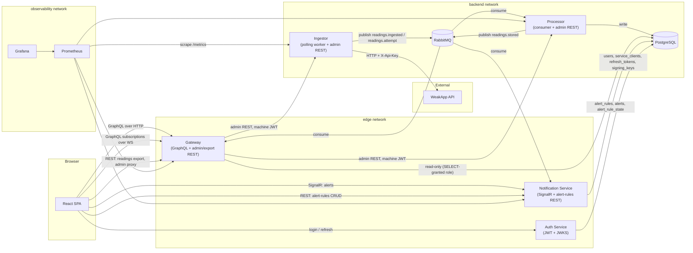

# Architecture

This document describes the system as it is actually built, cross-checked against the current
source tree rather than copied from the PRD's original proposal. Where the two disagree, this
document says so explicitly — see [Implementation notes](#implementation-notes) at the bottom.

For feature-level behaviour (`F1`…`F12`) and full context, see [`docs/PRD.md`](PRD.md) §4. The
decisions behind the four points this document exists to capture (per `tasks.json` TASK-007) are
recorded as ADRs in [`docs/adr/`](adr/) and linked from the relevant section below rather than
re-argued here.

## Service topology

Four PostgreSQL databases worth of data live in one physical instance (`weakapphandler`), each
behind its own least-privilege role — see
[ADR-0002](adr/0002-independent-migration-ownership.md) for why that is three independent
*migrating* `DbContext`s (Auth, Processor, Notification) plus the Gateway's two read-only,
non-migrating ones layered on top of the other services' tables.

## Services

| Service | Responsibility | Style | Owns (schema) |
|---------|----------------|-------|---------------|
| **Ingestor** | Polls WeakApp on a schedule, applies resilience policies (retry/timeout/circuit-breaker), publishes raw batches and attempt outcomes to the queue, exposes admin REST (`/api/v1/ingestion/*`) | Thin worker; no domain layer, no database access | Nothing — see [ADR-0001](adr/0001-ingestor-processor-responsibility-split.md) |
| **Processor** | Consumes `ReadingsIngested`/`IngestAttemptRecorded`, deduplicates by message id, normalises payloads, persists readings and current state, publishes `ReadingStored`, exposes admin REST (`/api/v1/processing/stats`) | Clean Architecture (Domain/Application/Infrastructure/Worker) | `meters`, `readings`, `meter_current_state`, `ingest_batches`, `processed_messages` |
| **Gateway** | Serves the typed GraphQL read API and subscriptions to the frontend; proxies the Ingestor's/Processor's admin REST through one machine-authenticated seam; streams a CSV export of readings | Application/Infrastructure layers, no Domain — see [ADR-0003](adr/0003-no-gateway-domain-layer.md) | Nothing (read-only role on Processor's and Notification's tables) |
| **Notification Service** | Owns alert rules and alert history, evaluates thresholds against `ReadingStored` events, pushes alerts over SignalR, exposes alert-rules REST CRUD | Layered; rule engine (`WeakAppHandler.Notification.RuleEngine`) isolated as a pure, dependency-free component | `alert_rules`, `alerts`, `alert_rule_state` |
| **Auth Service** | Issues user JWTs (login/refresh) and machine JWTs (client-credentials), publishes a JWKS document | Minimal; single bounded responsibility | `users`, `service_clients`, `refresh_tokens`, `signing_keys` |
| **Frontend** | React SPA — overview, history charts, alerts feed, administration (alert-rule CRUD + ingestion control), login | Feature-sliced (`app`/`features`/`entities`/`shared`) | — |

## Communication rules

Services do not call each other synchronously except for one deliberate path: the **Gateway's admin
proxy to the Ingestor and the Processor** (`AdminProxyController`, machine JWT minted via
client-credentials). Every other inter-service data flow goes through RabbitMQ. This is a design
commitment, not an accident — a failure in any one consumer cannot propagate back into ingestion,
and the Ingestor in particular never blocks on anything downstream of "publish and move on."

**Threshold evaluation lives in the Notification Service**, not the Processor. The rules are that
service's own data, so co-locating evaluation with them avoids a synchronous dependency the
Processor would otherwise need on Notification's schema. The Processor supplies the previous value
inside every `ReadingStored` event — it already computes that value for its own change-detection
flag (`is_changed`) — which lets the Notification Service detect threshold transitions without
holding a second copy of "what was this metric before."

**GraphQL subscriptions are fed from RabbitMQ**, not from PostgreSQL `LISTEN/NOTIFY` and not by a
direct push from the Processor. `ReadingStoredSubscriptionConsumer` binds its own queue to the same
`readings.stored` routing key Notification consumes — the topic exchange fans one publish out to
both independently — which keeps the Gateway stateless with respect to that stream. The
in-memory subscription execution strategy this implies, and the SignalR hub's equivalent choice on
the Notification side, are both single-replica limitations for the same underlying reason; see
[ADR-0004](adr/0004-signalr-single-replica-limitation.md).

**The Gateway has no domain model of its own.** It composes read queries against `IQueryable`
projections onto the Processor's and Notification's tables (through a database role granted `SELECT`
only) and forwards two kinds of write-shaped requests it does not itself own the data for: admin
actions (proxied, not re-implemented) and alert-rule CRUD (the frontend calls Notification's own
REST surface directly, bypassing the Gateway entirely — see the topology diagram above). See
[ADR-0003](adr/0003-no-gateway-domain-layer.md) for the reasoning.

## Networks

PRD §4.1 specifies three Docker networks — `edge` (Gateway, Notification, Auth, Frontend), `backend`
(Ingestor, Processor, RabbitMQ, PostgreSQL, WeakApp), `observability` (Prometheus, Grafana) — so that
the frontend's own network has no route to RabbitMQ or PostgreSQL. As of this document, only the
base infrastructure (`docker-compose.yml`: WeakApp, PostgreSQL, RabbitMQ) is actually composed;
placing the seven application services on their three networks is TASK-047's job. The segmentation
is already reflected in code today only insofar as connection strings and machine credentials are
scoped per service — no service's configuration currently assumes it can reach a network it will not
actually be placed on.

## Implementation notes

Documenting reality, not aspiration: the PRD's original §5 Technical Stack table lists a few choices
the codebase does not actually use, discovered while writing this document rather than assumed.
Nothing here should be read as an open task — each is either a superseded decision or PRD text that
was never load-bearing:

- **Charts are hand-rolled SVG** (`shared/ui/charts/`), not Recharts. No `recharts` dependency exists
  in `frontend/package.json`. The line/area/bar primitives were built directly against `viewBox`
  scaling and a "nice numbers" tick algorithm instead.
- **No MediatR anywhere in the solution.** Application-layer methods are called directly (e.g.
  `IGatewayReadContext`'s methods, `AlertEvaluator.EvaluateAsync`) rather than dispatched through
  commands/queries. CQRS separation, where it exists, is structural (separate read models and
  write paths) rather than mediator-based.
- **Tests use xUnit's own `Assert`**, not FluentAssertions — no such package reference exists.
- **No Playwright.** Frontend tests are Vitest + Testing Library; there are no end-to-end browser
  tests in this repository as of TASK-007.

None of these substitutions changed the behaviour the PRD specifies — they are implementation
choices below the level §4's architecture actually constrains.
