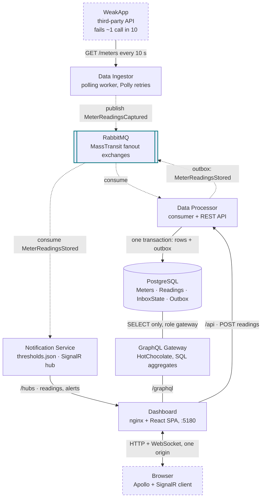
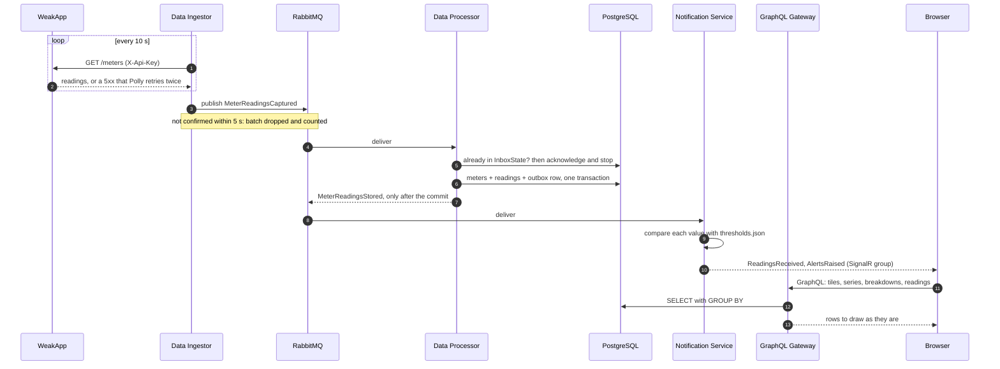
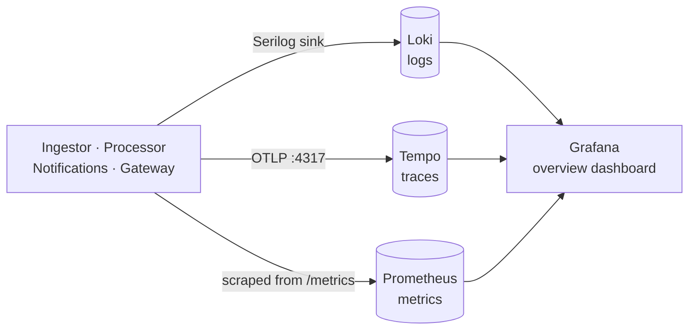
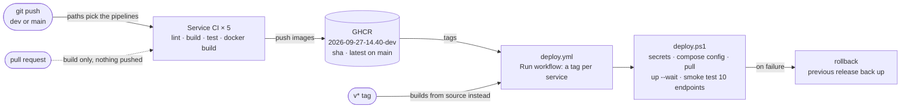

# Architecture

Each view comes twice. The SVG under `docs/architecture/` is the laid-out picture, with zones
and aligned labels, for reading. The [Mermaid](https://mermaid.js.org/) block after it is the
same view as text that GitHub draws in place; it is the one to edit when the system changes, and
the SVG is redrawn to match it afterwards.

## Runtime

Solid arrows are synchronous calls, dashed or dotted ones are messages through RabbitMQ.
Every service runs in docker-compose on one `backend` network.

```mermaid
flowchart TB
    WeakApp["WeakApp<br/>third-party API<br/>fails ~1 call in 10"]
    Ingestor["Data Ingestor<br/>polling worker, Polly retries"]
    RabbitMQ[["RabbitMQ<br/>MassTransit fanout exchanges"]]
    Processor["Data Processor<br/>consumer + REST API"]
    Postgres[("PostgreSQL<br/>Meters · Readings · InboxState · Outbox")]
    Notifications["Notification Service<br/>thresholds.json · SignalR hub"]
    Gateway["GraphQL Gateway<br/>HotChocolate, SQL aggregates"]
    Dashboard["Dashboard<br/>nginx + React SPA, :5180"]
    Browser["Browser<br/>Apollo + SignalR client"]

    WeakApp -- "GET /meters every 10 s" --> Ingestor
    Ingestor -. "publish MeterReadingsCaptured" .-> RabbitMQ
    RabbitMQ -. "consume" .-> Processor
    Processor -- "one transaction: rows + outbox" --> Postgres
    Processor -. "outbox: MeterReadingsStored" .-> RabbitMQ
    RabbitMQ -. "consume MeterReadingsStored" .-> Notifications
    Postgres -- "SELECT only, role gateway" --- Gateway
    Notifications -- "/hubs · readings, alerts" --> Dashboard
    Gateway -- "/graphql" --- Dashboard
    Dashboard -- "/api · POST readings" --> Processor
    Dashboard <-- "HTTP + WebSocket, one origin" --> Browser

    classDef external stroke-dasharray: 5 4
    classDef broker stroke:#0b7a85,stroke-width:2px
    class WeakApp,Browser external
    class RabbitMQ broker
```

The only way into the database is the processor. The ingestor and `POST /api/readings` both
publish the same `MeterReadingsCaptured` message, so a submitted reading takes exactly the path
of a polled one. The gateway holds a `SELECT`-only role, and the browser talks to nothing but
the dashboard's nginx, which proxies `/graphql`, `/api` and `/hubs`.

## One reading, step by step

```mermaid
sequenceDiagram
    autonumber
    participant W as WeakApp
    participant I as Data Ingestor
    participant Q as RabbitMQ
    participant P as Data Processor
    participant DB as PostgreSQL
    participant N as Notification Service
    participant G as GraphQL Gateway
    participant B as Browser

    loop every 10 s
        I->>W: GET /meters (X-Api-Key)
        W-->>I: readings, or a 5xx that Polly retries twice
    end
    I->>Q: publish MeterReadingsCaptured
    Note over I,Q: not confirmed within 5 s: batch dropped and counted
    Q->>P: deliver
    P->>DB: already in InboxState? then acknowledge and stop
    P->>DB: meters + readings + outbox row, one transaction
    P-->>Q: MeterReadingsStored, only after the commit
    Q->>N: deliver
    N->>N: compare each value with thresholds.json
    N-->>B: ReadingsReceived, AlertsRaised (SignalR group)
    B->>G: GraphQL: tiles, series, breakdowns, readings
    G->>DB: SELECT with GROUP BY
    G-->>B: rows to draw as they are
```

- **Poll.** Polly retries a 5xx, a network fault or a timeout twice with backoff; a `429` is
  not retried, because the next tick is the backoff.
- **Publish.** Payloads that fail to parse are dropped, and an empty batch is not sent. A batch
  the broker does not confirm within 5 s is dropped and counted in
  `weakapphandler.batches.publish_failed`.
- **Consume once.** A message whose `MessageId` is already in `InboxState` is acknowledged
  without running the consumer again. Failures are retried three times.
- **Store with its event.** The outbox delivers `MeterReadingsStored` only after the commit, so
  nobody is told about a reading GraphQL cannot return yet.
- **Push.** Alerts go to the SignalR groups that match the reading: all, by location, by metric,
  or both.
- **Read.** Filtering, bucketing and aggregation run in SQL; the browser draws exactly the rows
  it receives.

## Observability

Started by the `observability` profile. Without it the services still try to send logs and
traces, and the exporters drop them quietly.

```mermaid
flowchart LR
    Services["Ingestor · Processor<br/>Notifications · Gateway"]
    Loki[("Loki<br/>logs")]
    Tempo[("Tempo<br/>traces")]
    Prometheus[("Prometheus<br/>metrics")]
    Grafana["Grafana<br/>overview dashboard"]

    Services -- "Serilog sink" --> Loki
    Services -- "OTLP :4317" --> Tempo
    Services -- "scraped from /metrics" --> Prometheus
    Loki --> Grafana
    Tempo --> Grafana
    Prometheus --> Grafana
```

## Delivery

```mermaid
flowchart LR
    Push(["git push<br/>dev or main"])
    PR(["pull request"])
    CI["Service CI × 5<br/>lint · build · test · docker build"]
    GHCR[("GHCR<br/>2026-09-27-14.40-dev<br/>sha · latest on main")]
    Tag(["v* tag"])
    Workflow["deploy.yml<br/>Run workflow: a tag per service"]
    Script["deploy.ps1<br/>secrets · compose config · pull<br/>up --wait · smoke test 10 endpoints"]
    Rollback["rollback<br/>previous release back up"]

    Push -- "paths pick the pipelines" --> CI
    PR -. "build only, nothing pushed" .-> CI
    CI -- "push images" --> GHCR
    GHCR -- "tags" --> Workflow
    Tag -- "builds from source instead" --> Workflow
    Workflow --> Script
    Script -- "on failure" --> Rollback
```

A push rebuilds only the services whose files changed, so a release is one tag per service
rather than one tag for the stack. On a GitHub runner the stack is torn down after the smoke
tests; on a real server it would stay up and `.deploy-state.json` would make the rollback
useful. See [Deployment](../README.md#deployment) for the commands.

## Where the guarantees come from

| Guarantee | Mechanism |
|-----------|-----------|
| No duplicate writes | `InboxState` remembers each handled `MessageId` for a day, so a message RabbitMQ redelivers is acknowledged without touching the database again. |
| No notification without data | The outbox row commits with the readings. If the process dies in between, the redelivered message sends the pending event instead of storing twice. |
| Losses are counted, not hidden | A batch the broker refuses is dropped, logged as event `10` with its `BatchId`, counted in Prometheus and raised by the `IngestorBatchesDropped` rule. |
| Least privilege on reads | The gateway connects as `gateway`, which `db/init/01-gateway-role.sh` grants `SELECT` on every table the processor creates. |

The SVGs are hand-written; edit them as text and keep every colour inside the `<style>` block
at the top of each file, which carries both the light and the dark palette.
